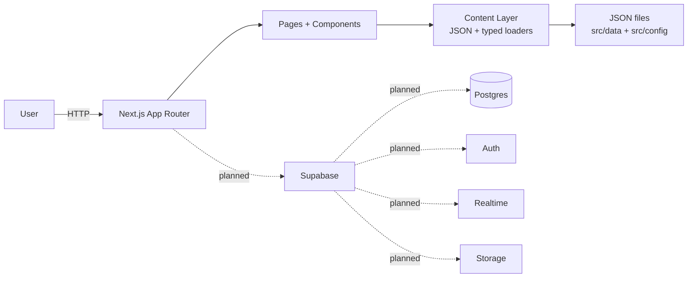
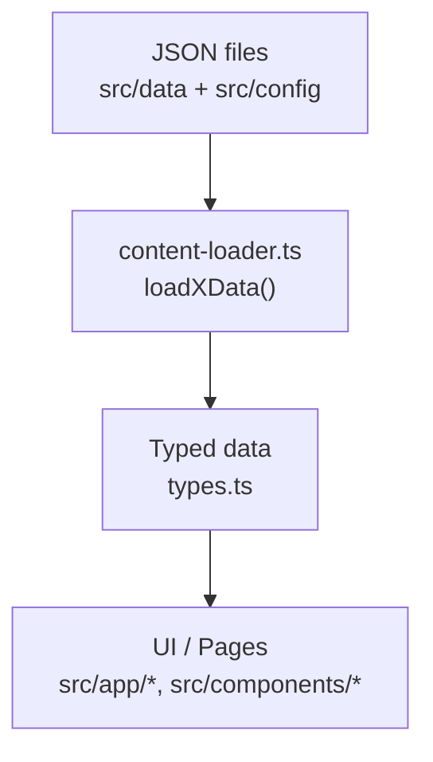
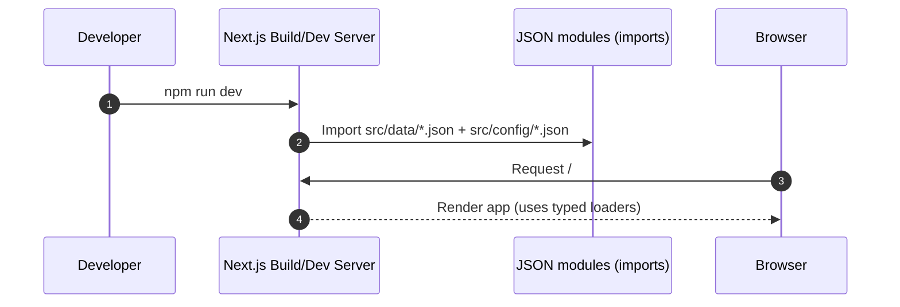
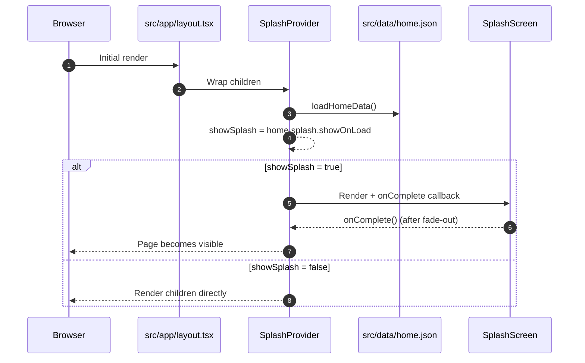
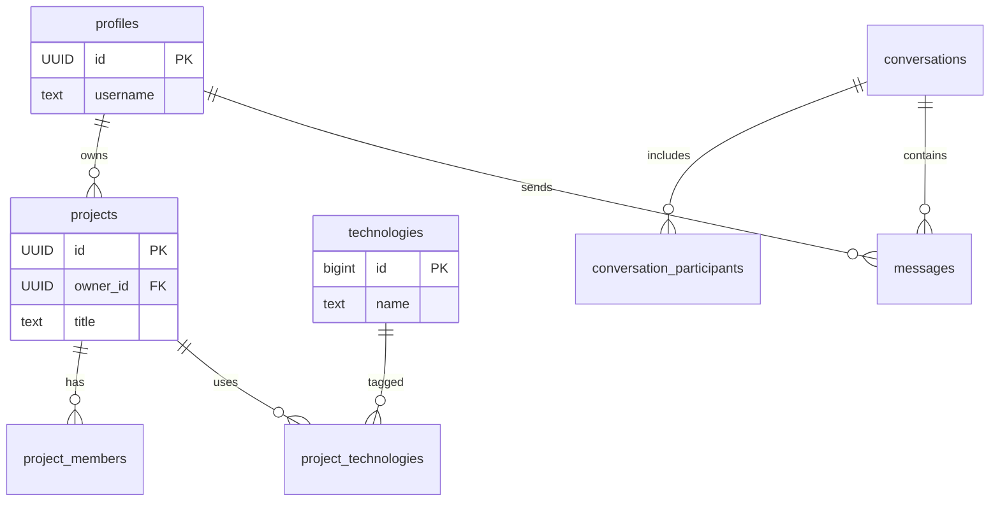

# FinderDev

[](https://nextjs.org/)


-3ECF8E?logo=supabase&logoColor=white)

A collaborative social platform designed to bridge the gap between **software developers**, **designers**, and **project managers**.

> **Note:** Supabase is part of the target architecture/spec, but it is **not integrated in the current codebase yet**.

## Table of Contents

- [Badge wall (tech matrix)](#badge-wall-tech-matrix)
- [Overview](#overview)
- [Current Status](#current-status)
- [Tech Stack](#tech-stack)
- [Requirements](#requirements)
- [Quickstart](#quickstart)
- [Scripts](#scripts)
- [Project Structure](#project-structure)
- [Content Layer (JSON)](#content-layer-json)
- [Where to Edit Content](#where-to-edit-content)
- [Architecture Notes](#architecture-notes)
- [Features](#features)
- [Diagrams (Mermaid)](#diagrams-mermaid)
- [Planned Supabase (Spec) Notes](#planned-supabase-spec-notes)
- [Troubleshooting](#troubleshooting)
- [Roadmap (high level)](#roadmap-high-level)
- [Documentation](#documentation)

## Badge wall (tech matrix)

- **Current (in this repo today)**
  - **Languages**
    - 
    - 
    - 
  - **Runtime / package manager**
    - 
    - 
  - **Framework / UI**
    - 
    - 
    - 
    - 
  - **Quality / tooling**
    - 
    - 

- **Planned (spec)**
  - **Backend**
    - 
    - 
  - **Features**
    - 
    - 

## Overview

FinderDev aims to be a **project hub + talent marketplace + team formation** platform:

- **Profiles**: showcase skills, links, and portfolio
- **Projects**: publish project ideas, required roles, and tech stack
- **Discovery**: filter/search projects and people
- **Collaboration**: (planned) chat + notifications tied to projects/applications

## Current Status

What exists today in this repo:

- **Next.js App Router** foundation
- **Splash experience** (configurable via JSON)
- **JSON-driven content layer** with TypeScript types
- Tailwind setup + a small UI component set (`src/components/ui/`)

What is **planned** (see spec):

- Supabase **Auth / DB / Realtime / Storage**
- Project CRUD, applications, messaging, notifications, filtering engine

## Tech Stack

- **Framework:** Next.js 15 (App Router)
- **Language:** TypeScript
- **Styling:** Tailwind CSS + shadcn/ui
- **Backend (planned):** Supabase

## Requirements

- **Node.js:** 18+ recommended
- **Package manager:** npm

## Quickstart

```bash
npm install
npm run dev
```

Then open `http://localhost:3000`.

## Scripts

- **Dev:** `npm run dev`
- **Build:** `npm run build`
- **Start (prod):** `npm run start`
- **Lint:** `npm run lint`

## Project Structure

Key locations (clickable):

- **App Router:** [`src/app/`](./src/app/)
- **Components:** [`src/components/`](./src/components/)
- **Content (JSON):** [`src/data/`](./src/data/)
- **Site config:** [`src/config/`](./src/config/)
- **Content loaders + types:** [`src/utils/`](./src/utils/)
- **Product spec:** [`docs/analysis.md`](./docs/analysis.md)

```txt
finder-dev/
├── docs/
│   └── analysis.md               # Product + architecture specification
├── src/
│   ├── app/                      # Next.js App Router (routes/layouts/pages)
│   ├── components/               # Reusable components
│   ├── config/                   # Site-wide JSON config
│   ├── data/                     # Page/content JSON files
│   └── utils/                    # Typed JSON loaders + type definitions
└── public/                       # Static assets
```

## Content Layer (JSON)

This project uses a **JSON-driven content layer** for UI copy and page configuration.

How it maps today:

- `src/config/site-data.json` → `loadSiteData()` → metadata in [`src/app/layout.tsx`](./src/app/layout.tsx)
- `src/data/home.json` → `loadHomeData()` → [`src/app/page.tsx`](./src/app/page.tsx) and [`src/components/layout/SplashProvider.tsx`](./src/components/layout/SplashProvider.tsx)
- `src/data/splash.json` → `loadSplashData()` → [`src/app/splash/SplashScreen.tsx`](./src/app/splash/SplashScreen.tsx)

Core implementation files:

- JSON loaders: [`src/utils/content-loader.ts`](./src/utils/content-loader.ts)
- JSON types: [`src/utils/types.ts`](./src/utils/types.ts)

## Where to Edit Content

- **Home hero text + splash toggle:** [`src/data/home.json`](./src/data/home.json)
- **Splash title/tagline/animation timings:** [`src/data/splash.json`](./src/data/splash.json)
- **Site name/SEO metadata:** [`src/config/site-data.json`](./src/config/site-data.json)

## Architecture Notes

- **Path aliases:** `@/*` resolves to `src/*` (see `tsconfig.json`).
- **Content loading approach:** JSON is imported at build time and returned via typed loader helpers (no runtime fetch yet).
- **Backend integration:** Supabase is referenced in the spec, but there are currently **no env vars** and **no Supabase client** in the codebase.

## Features

- **Splash Screen:** Beautiful animated splash screen on app load
- **Content Management:** JSON-based content management system
- **Type Safety:** Full TypeScript support with type definitions
- **Dark Mode:** Built-in dark mode support

## Diagrams (Mermaid)

### System map (current vs planned)



### JSON content loading (current)



### Build-time vs runtime (current)



### Splash display flow (current)



### (Planned / Spec) Database model (high level)

> From `docs/analysis.md` (not implemented yet).



## Planned Supabase (Spec) Notes

When Supabase is added, this README should gain:

- A `.env.example` (with `NEXT_PUBLIC_SUPABASE_URL` and `NEXT_PUBLIC_SUPABASE_ANON_KEY`)
- Database migrations (SQL) + RLS policies
- Auth providers (GitHub/Google/email) + profile sync triggers

## Troubleshooting

- **Blank page on first load**: the home page waits for JSON to load into state; check the browser console for `Failed to load home data`.
- **Splash not showing**: set `splash.showOnLoad: true` in [`src/data/home.json`](./src/data/home.json).
- **Lint issues**: run `npm run lint` and address Next.js ESLint suggestions.

## Roadmap (high level)

See the detailed plan in [`docs/analysis.md`](./docs/analysis.md). High-level milestones:

- Supabase setup (Auth + DB schema + RLS)
- Project CRUD + role-based applications
- Discovery engine (filtering + search)
- Chat + notifications (Supabase Realtime)

## Documentation

See [`docs/analysis.md`](./docs/analysis.md) for the full product + architecture specification.
